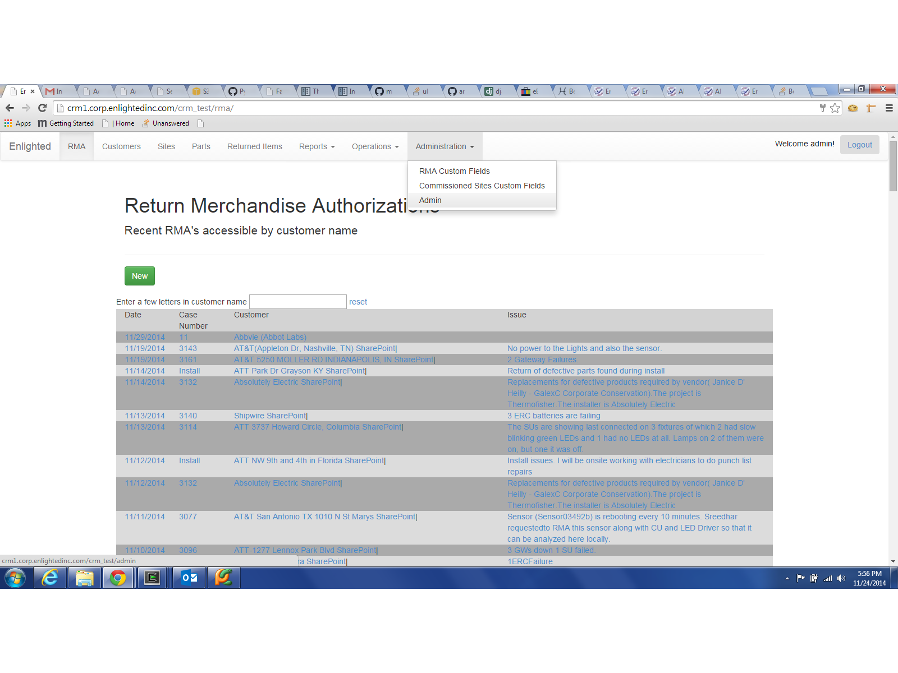
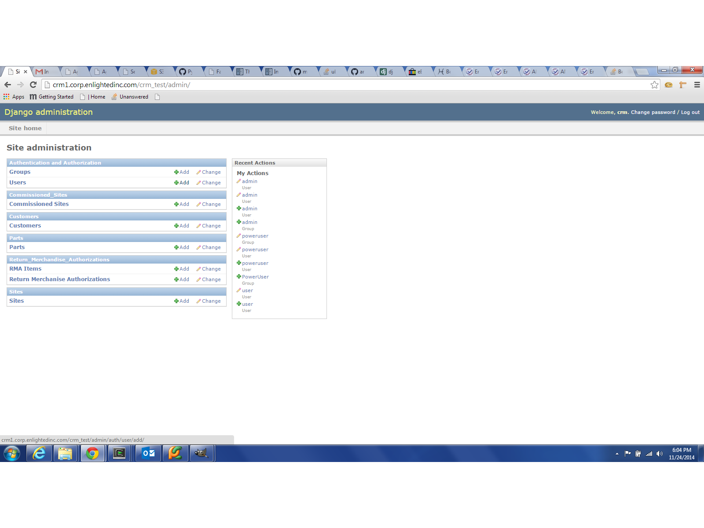
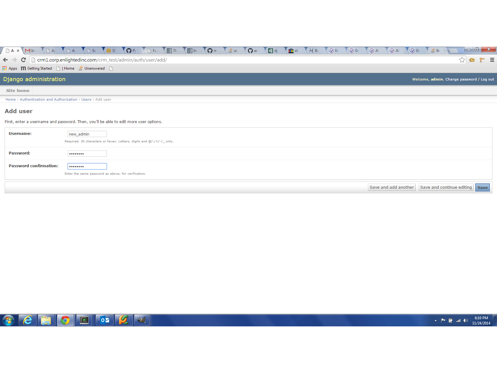
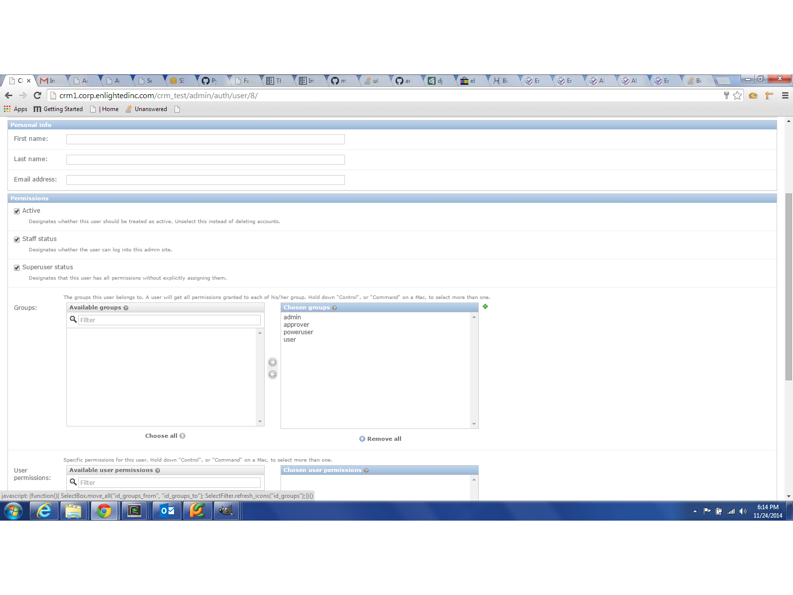
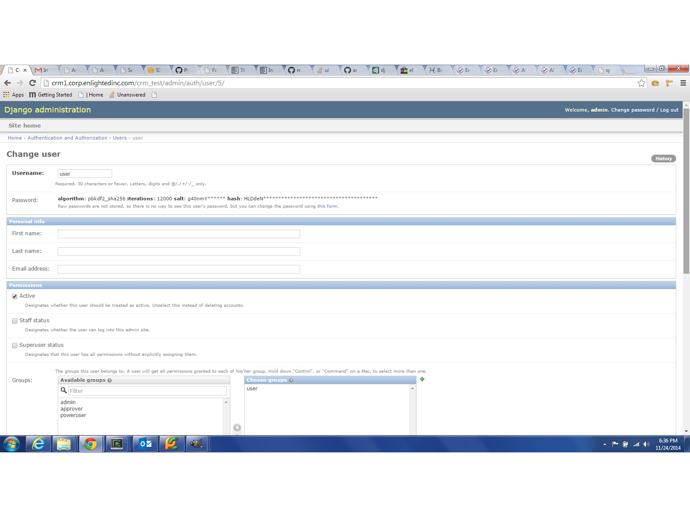
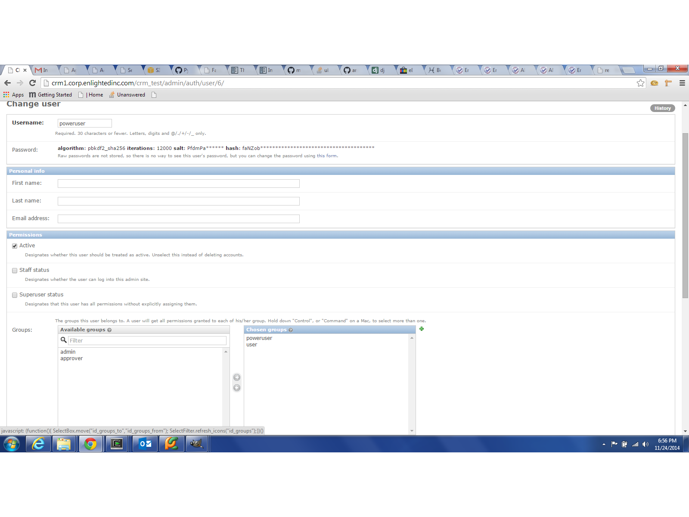
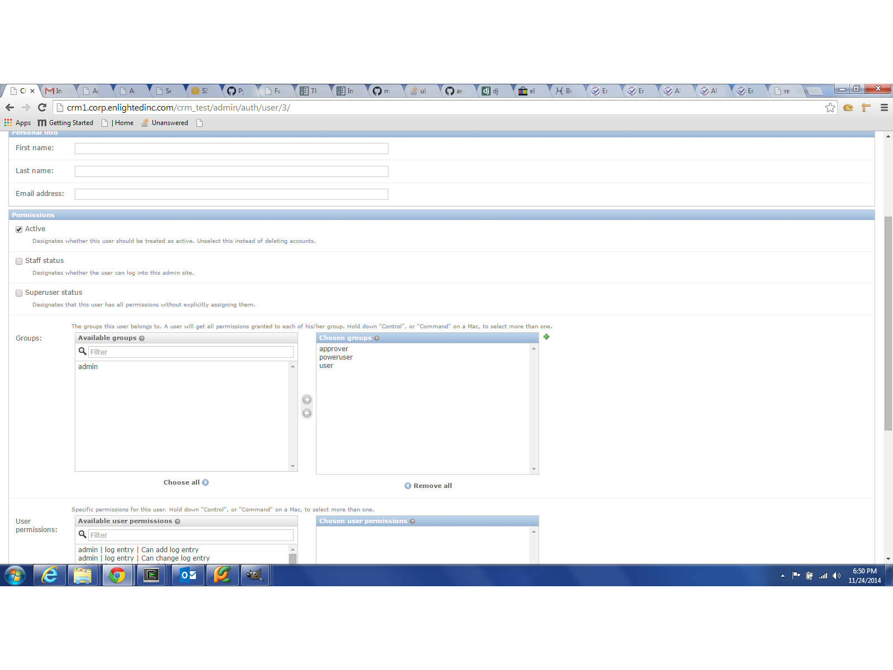

Access Control/User Groups
==========================

The access controls are going to be contained in Django Groups app.

Groups
~~~~~~
* viewer - belongs to no group
* user - belongs to 'user' group
* approver - belongs to 'approver' group
* poweruser - belongs to 'poweruser' group
* admin - belongs to 'admin' group

Viewer
~~~~~~
The basic loggedin user.  Can see most things, but cannot change anything.

User
~~~~
Can add and edit most items.  Not allowed to delete.
Approver
~~~~~~~~
Only has one privilage, to approve RMAs.

Poweruser
~~~~~~~~~
Has all the privilages as 'User' but can delete records.

Admin
~~~~~
Has access to the Django admin panel.

.. _creating_admin_user:

Creating a Admin User
=====================
Admin users can only be created by other admin users from the user interface.

Find the Django Control Panel Navigation button.

You have to add a user in the Django panel and then add the privilages. Find the 'add' button next to the Users application.

Fillout username and password and Save.

This will expose the Change User form.  To make this user and admin, check off 'Staff Status' and 'Superuser Status'. Press the
'Choose All' button in the groups section to select all Groups.

Creating a New User
===================
To create a new user with 'viewer' privilages follow the first 3 steps of :ref:`creating_admin_user` above and stop short of assigning groups
or staff rights or superuser rights

Assigning Access Level to a User
================================

'User' privilages
~~~~~~~~~~~~~~~~~
The 'user' role is just one step above 'viewer'.  As an 'Admin' go to the Django admin panel and choose the user to go to
the Change User form.

For a 'user' role make user 'Staff Status' and 'Superuser Status' are turned off and that the user only belongs to the
'user' group.

'Poweruser' privilages
~~~~~~~~~~~~~~~~~~~~~~

The 'poweruser' role is one step above 'user'.  Has all the privilages of 'user' plus the power to delete records'

'Approver' privilages
~~~~~~~~~~~~~~~~~~~~~

The 'approver' role is one step above 'poweruser'.  Has all the privilages plus the ability to approve RMA's.

