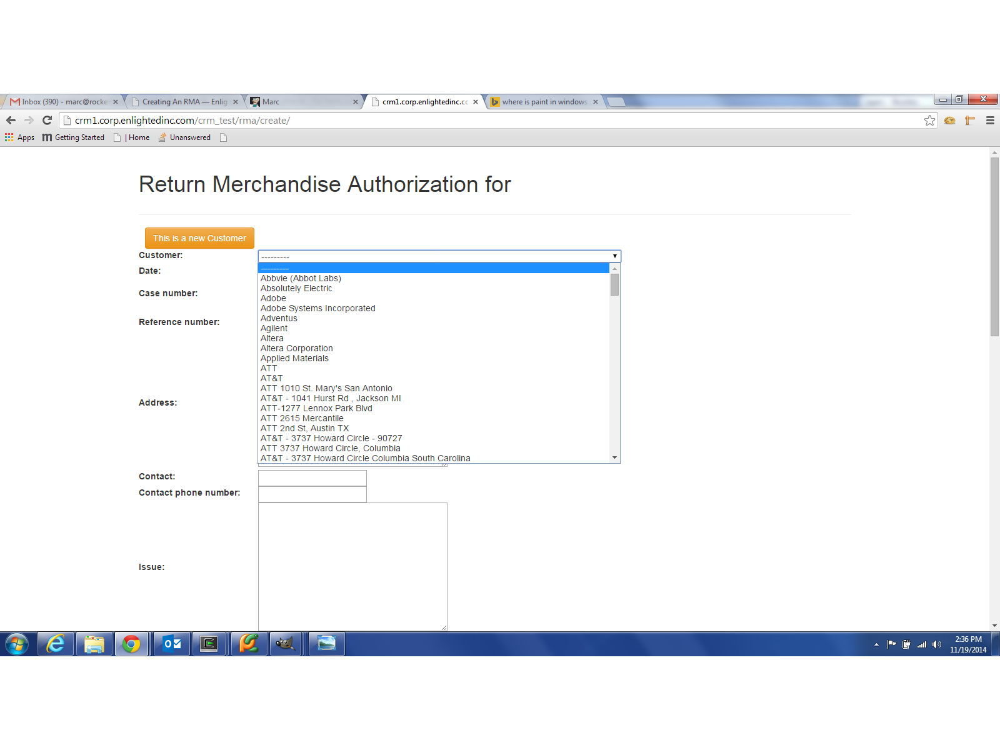

Creating An RMA
===============
RMAs can be created for new or existing customers.

To add a new RMA, go to the crm's home page, the first page that opens up, or press the navigation button
'RMA".  You should see a list of
RMAs and a green button that says 'New'.  Press new.

You will see the form for entering new RMA's for existing customers.
If this is an existing customer, continue to fill out the form.

Information required for the New RMA
------------------------------------
Expect to see errors if this information is missing from the New-RMA-existing-customer form
* if you don't select a customer
* no date
* no Sales Force case number
* no contact name
* no parts selected

If your returned item isn't on the parts list, select 'other'.

Create An RMA for an existing customer
--------------------------------------
If the customer exists on the customer list you do not need to enter a new customer with the new rma.  You can just
select the customer from the drop-down list.

Create An RMA for a New customer
--------------------------------
If the customer is new to the system the new customer must be entered with a new RMA.  "Press the Don't See the customer? press here" button
to change the form for new customers.

