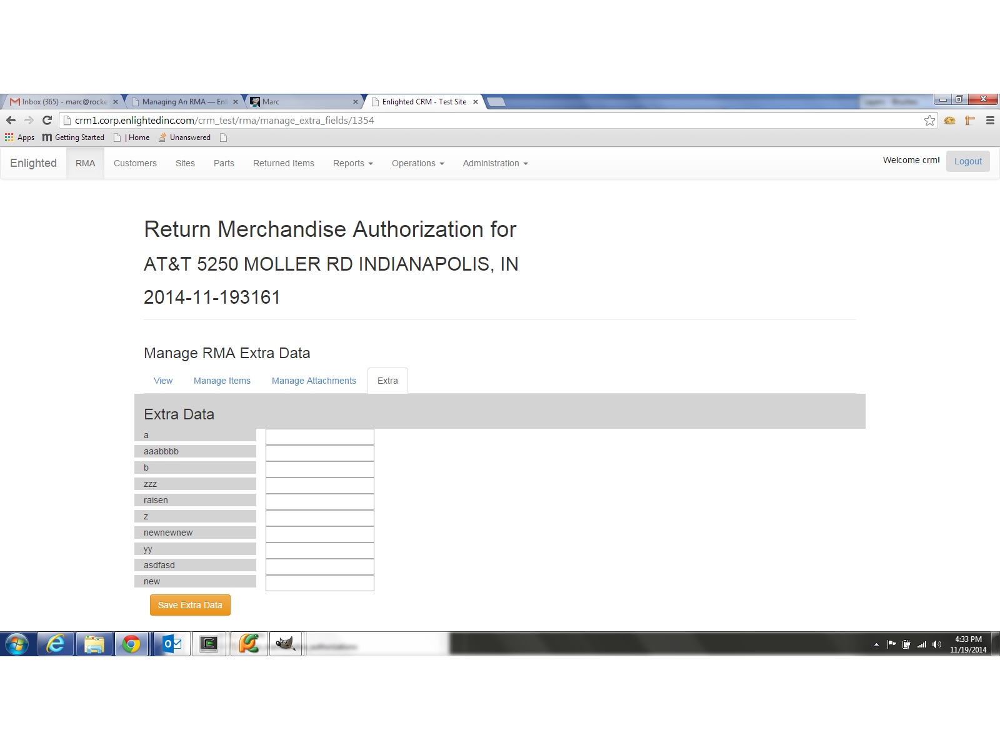

Managing An RMA
===============
Once and RMA has been created it can be modified.

* you can edit the RMA's basic information
* you can add attachments to the RMA Record
* you can change the list of returned items
* you can change the extra data items

Changing an RMA's Extra Data
----------------------------

Once an RMA is created you can change it's Extra Data fields from the Extra Data tab of a selected RMA view.

Simply insert your data and press 'Save Extra Data'

Uploading an attachment to an RMA's
-----------------------------------

To add and attachment to an RMA, select the RMA from the RMA list. If you just added the new RMA you are viewing the RMA.
Select the 'Manage Attachments" tab and press the "Create RMA Attachement" button.  Select a file to upload in the form and
press "Save RMA Attachment".
