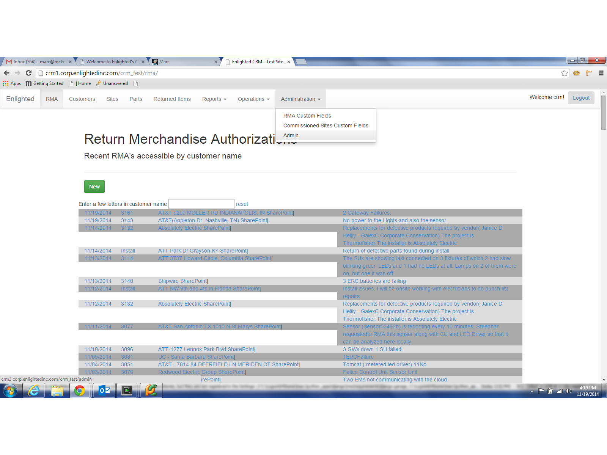
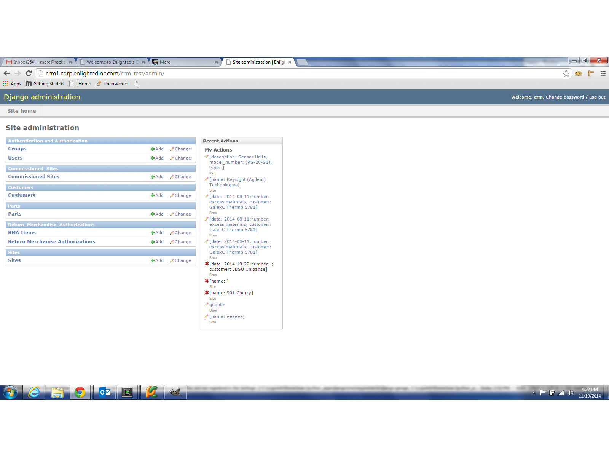
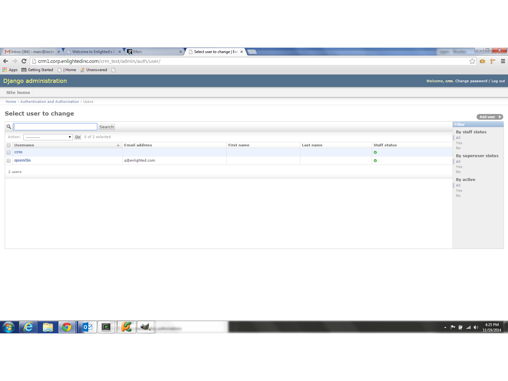

Managing CRM Users
==================

For user management we are using the user management application baked into Django.

To find the Django Admin Panel navigate to Administration-Admin

In the Django Admin Panel travel to "Authentication and Authoriztion/Users"

From there you can add and delete users and change their privileges.

