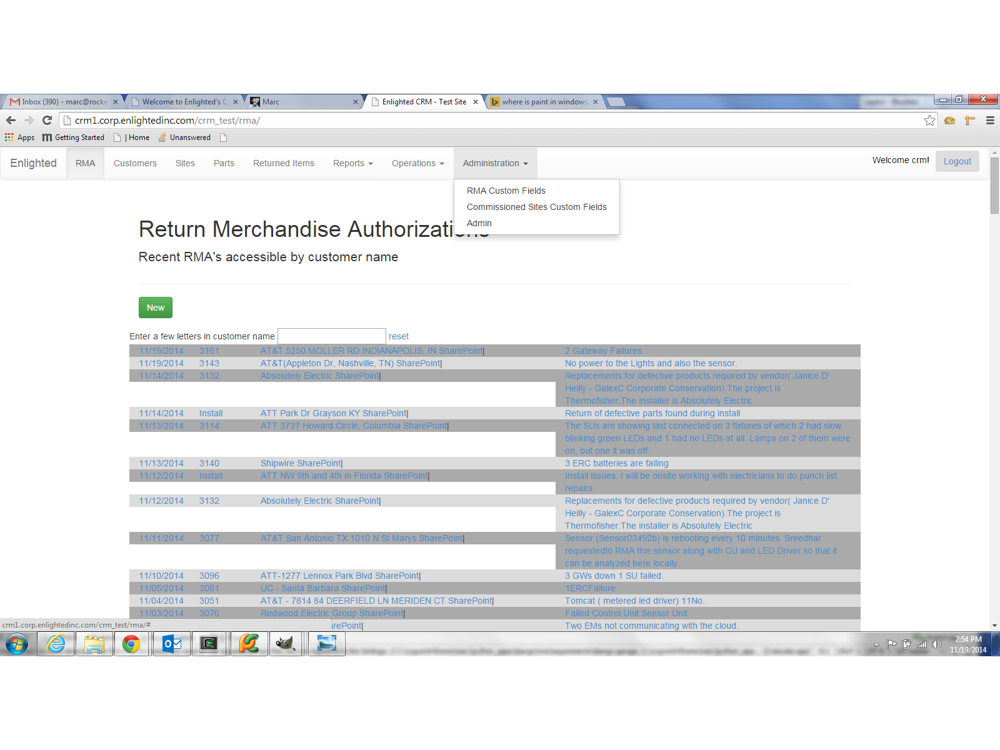
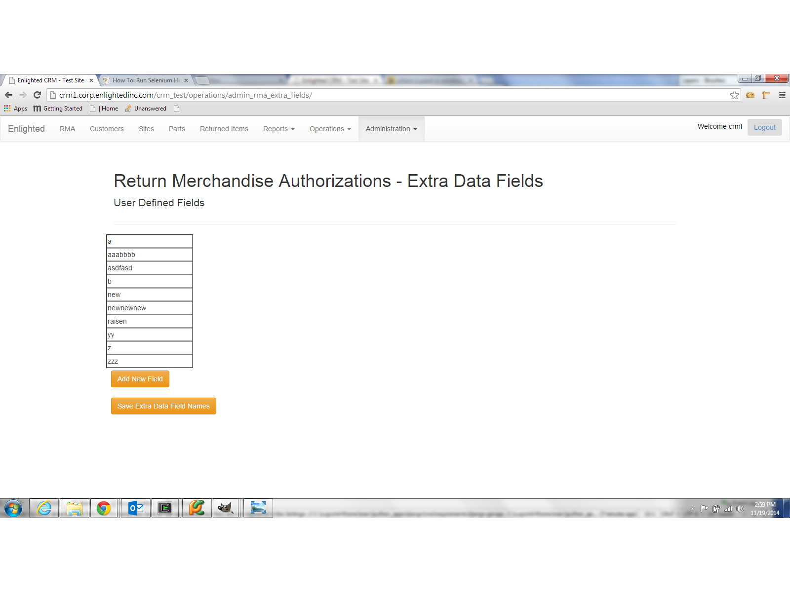
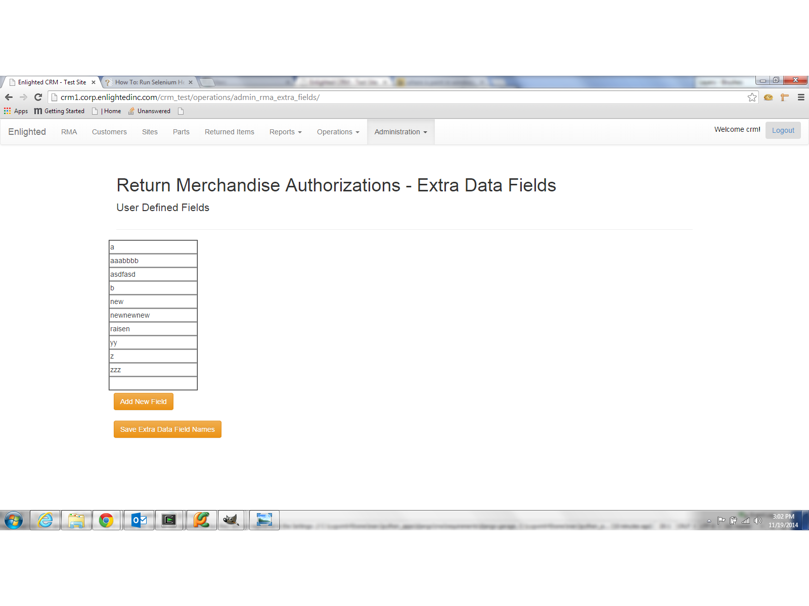

RMA Extra Data
==============
The RMA table can be expanded with extra rows to handle the new to track data unforseen at the time of it's development.

To add new extra data fields for RMAs, follow the navigation to Administration-RMA Custom Fields

Extra fields can only be entered, so be very careful!

Adding a custom field to RMAs
-----------------------------

Press 'Add New Field' and a blank field will appear at the bottom of the list

Enter a new field name and press 'Save Extra Data Field Names'