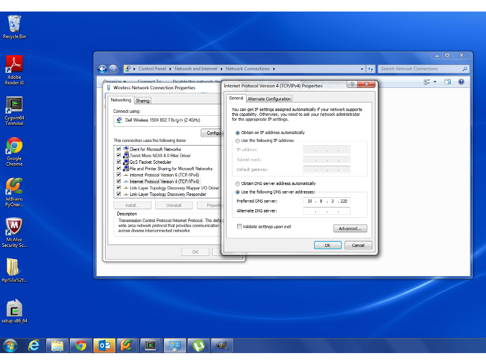

.. _sites:

=====
Sites
=====

==========
DNS Server
==========

The soap services will not work until you set your computer to use the corporate DNS server.

  10.8.3.220

On Windows 7, go to control panel, go to "Network and Internet" -> "Network Connections".  If you are using a wired connection
right-click the wired connection, and select 'properties'.  If you are wireless, right-click wireless, and select 'properties'.
Find TCP/IPv4, check "use the following dns server addresses"
and enter the above ip.

Production
----------

This site is under source control and will be rarely be touched.  This code will only feature code that has been accepted
on Test, tagged, committed and then checked out.

Test
----

Test will build this documentation.  Test will be the place to harmlessly run tests.  Test will be where ACL on Groups
will be designed, tested, and migrated to Production.